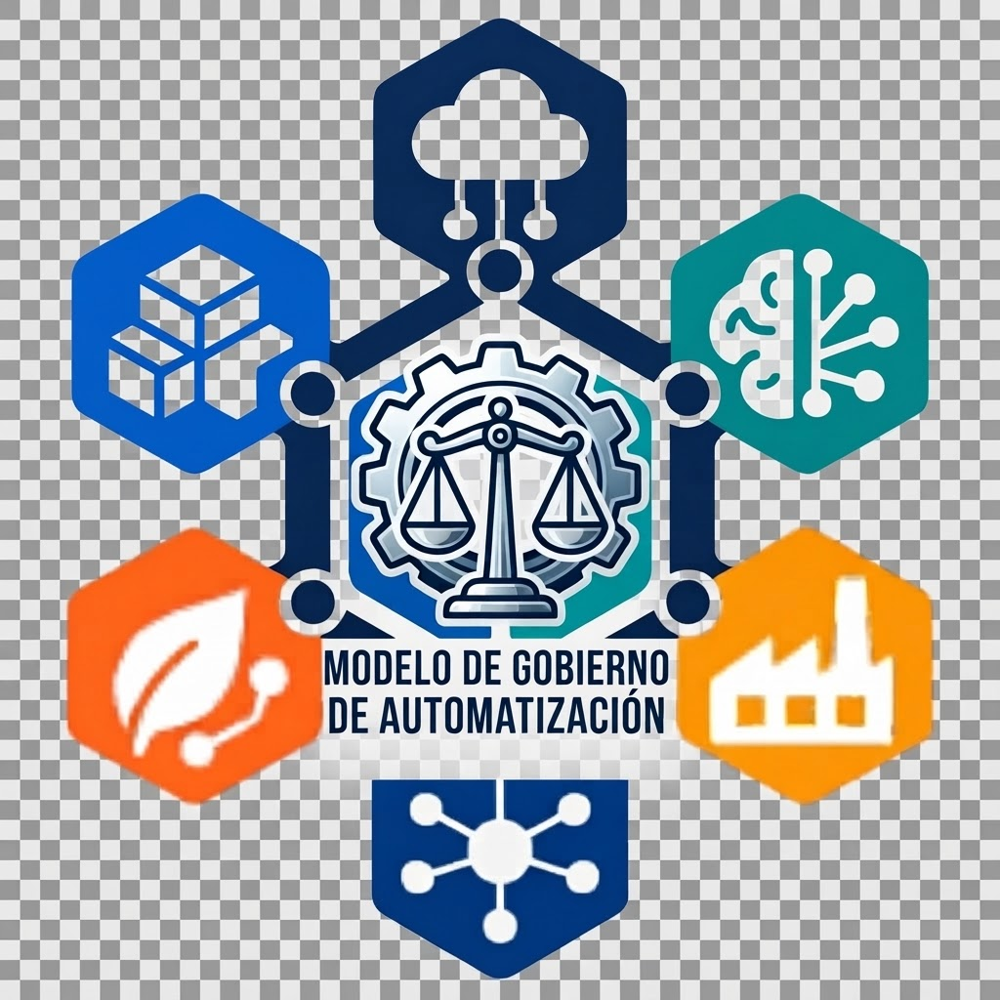

# Open Demo Platform — Modelo de gobierno de automatización



Workshop comunitario de Open Industries para institucionalizar el gobierno de Ansible / AAP en siete dominios. Identidad Open Demo Platform con el logo de gobierno de automatización proporcionado por Heber Romero. Material en español.

## Contenido
- [Inicio y preparación](docs/00-inicio.md)
- [Modelo de gobierno](docs/02-modelo.md) y [RACI global](docs/03-roles-raci.md)
- [Git y releases](docs/04-git.md), [AAP y ciclo de vida](docs/05-ciclo-vida.md)
- [Ejercicio por dominios](docs/07-ejercicio.md) y [roadmap](docs/08-roadmap.md)
- [Agenda y facilitación](docs/10-facilitacion.md)
- [Secrets](docs/09-secrets.md) y [publicación](docs/11-publicacion.md)
- [Presentación navegable e imprimible](slides/index.html)
- Plantillas editables en `templates/`, contratos de configuración en `aap/`
- Siete playbooks ejecutables de laboratorio y fichas de integración en `examples/`

## Laboratorio
```bash
python3.11 -m venv .venv
source .venv/bin/activate
python -m pip install -r requirements-dev.txt
ansible-playbook -i inventories/lab/hosts.yml playbooks/virtualizacion.yml
ansible-playbook -i inventories/lab/hosts.yml playbooks/virtualizacion.yml
```
La segunda ejecución debe tener `changed=0`. Los ejemplos representan recursos en archivos locales, no provisionan infraestructura real. AAP/AWX es opcional para el ejercicio local y necesario para validar el recorrido en controller.

## Portal
```bash
python scripts/build_site.py
python scripts/validate_content.py
python -m http.server 8000 --directory public
```
Abrir localhost:8000. Para publicar, el workflow Antora usa el tema Showroom con marca Open Demo Platform. El administrador debe habilitar Pages como GitHub Actions. La URL sólo queda activa después de un deployment exitoso. Consultar `docs/11-publicacion.md`.

## Verificación
```bash
yamllint .
ansible-lint playbooks roles molecule
molecule test
python scripts/validate_raci.py templates/raci-editable.csv
```
CI valida contenido, lint, Molecule y secrets. Las reglas de protección y equipos de CODEOWNERS se configuran en GitHub; no quedan activados por este README.

## Alcance
Agenda compacta de ocho horas con preparación previa y versión ampliada de 9 h 15 min–11 h 15 min más pausas. Open Demo Platform identifica la marca de este workshop comunitario. Los nombres técnicos de AAP y los enlaces a documentación oficial se conservan.
